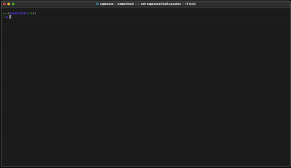

```
 ██████╗████████╗███████╗███████╗
██╔════╝╚══██╔══╝██╔════╝██╔════╝
██║        ██║   █████╗  █████╗  
██║        ██║   ██╔══╝  ██╔══╝  
╚██████╗   ██║   ███████╗███████╗
 ╚═════╝   ╚═╝   ╚══════╝╚══════╝
```
## Command Line Session Transcription & Recording
CTEE is a suite of tools designed to enhance the command-line interface on Linux and MacOS systems. It allows users to record and replay CLI sessions, take notes, manipulate timing, and perform other related tasks. The overall project is useful for learning, teaching, troubleshooting, documenting, and sharing *BASH* CLI activities.



## Functionality

>- Record and replay CLI sessions
>- Take notes related to CLI activities
>- Manipulate the timing of replayed sessions
>- Sanitize recorded sessions

## Installation

To install CTEE, run the `install.sh` script as a standard user. The necessary scripts and binaries will be placed in `/usr/local/bin` and the data will be stored in the `~/.ctee/` directory.

Please note that CTEE must be started from within a *bash shell only* and has only been tested on *MacOS* and *Linux* systems. If you want to change the default shell for the user, you can use the `chsh -s /bin/bash` command and restart terminal. To change it back afterwards, you can use the `chsh -s /bin/<your_previous_shell>` command and then restart terminal.

## Usage

After installing CTEE, you can start a new session, record your activities, take notes, replay sessions, modify timing, and sanitize recorded scripts. Here are the main commands:

- `ctee`: Start a new session
- `cn`: Write notes within a running ctee session
- `clook`: Interactive, post session review as well as output and producing an html transcript

## Extended Clook Usage

Clook allows you to review your previous session via CLI Interactively and has a rich set of functionality on its own as a result. This includes the ability to print all commands of a previous session with or without their respective stdout's, grep against your previous notes/commands/stdouts, print only a given command by an assigned command id, and/or produce an html report of what you see produced by clook in your current working directory. 

```
usage: clook [-h] [-s SEARCH] [-m MODE] [-n N] [-d DIR] [-o] [-p] [-c CMD_ID]

Search in sqlite databases.

options:
  -h, --help            show this help message and exit
  -s SEARCH, --search SEARCH
                        The search term
  -m MODE, --mode MODE  Mode, either "before" or "after"
  -n N                  Number of rows to print before or after the match
  -d DIR, --dir DIR     Directory to search for databases
  -o, --stdout          Option to show stdout
  -p, --html            Generate HTML output
  -c CMD_ID, --cmd_id CMD_ID
                        The command id to search

```
_Please note that you MUST run clook from the same directory that the sqllite3 database from a previous ctee session is, or provide a directory to search for databases. Please also note that if there are multiple sqlite3 databases in a given directory, it WILL parse them all in one go. This is by design._

## Considerations 
_The CTEE home directory is located at `~/.ctee/` and contains recorded sessions, which are automatically cleaned up after 7 days or when the count exceeds 20. Please use CTEE responsibly and avoid recording sensitive information._
